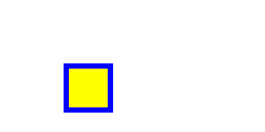

<p align="center">
  <!-- <a href="http://nestjs.com/" target="blank"></a> -->
  
</p>


## mui.js - cuerpos
Motor simulador y graficador de cuerpos rígidos     
Completamente en Español      
Proyecto de estudio       
Creado por Nicolás Donoso       

## Descripción
__'mui.js - cuerpos'__ es un motor para simular y graficar interacciones entre cuerpos rígidos.   
Hasta el momento permite:   
- crear y dibujar figuras geométricas     
- crear cuerpos con formas geométricas      
- mover y acelerar cuerpos      
- detectar colisiones entre cuerpos y con cuerpos contenedores      
- crear cuerpos atractores y repulsores    
- crear cuadrículas y pintar sus celdas según su estado 
- incorporar controles y eventos con mouse y teclado
- choque elástico entre circunferencias
- grabar canvas
- control de tick y fps
- calcular colisiones con quadtree  

## Contenidos

1. [Instalación](#instalacion)
2. [Primeros pasos](#primeros-pasos)
3. [Proyectos creados con mui.js - cuerpos](#ejemplos)

<a name="instalacion"></a>
## Instalación

```bash
npm install muijs-cuerpos
```

<a name="primeros-pasos"></a>
## Primeros pasos

### 1. Canvas
__'mui.js - cuerpos'__ utiliza el elemento HTML Canvas.   
Para dibujar, tienes que tener en tu proyecto un canvas con su id definida:

```html
<canvas id="mi-canvas"></canvas>
```

### 2. Importaciones
En un archivo TypeScript importa la herramienta de renderizado y el generador de formas geométricas.

```typescript
import { Renderizado, Forma } from 'muijs-cuerpos'
```

### 3. Definiendo un cuadrado
La herramienta __Forma__ permite crear distintas formas geométricas. 
Usaremos el método __rectangulo__ :
```typescript
Forma.rectangulo(x: number, y: number, base: number, altura: number, opciones?: OpcionesForma & OpcionesGraficasForma)
```   
Los primeros 2 parámetros son para las coordenadas (x, y) de su centro (considera que en el Canvas el eje Y está invertido, el origen está arriba y aumenta hacia abajo).   
Los siguientes 2 parámetros son las dimensiones de la figura, en este caso Base y Altura.   
El parámetro opcional de estilo permite definir colores y maneras en que será dibujada la figura.

Un ejemplo:
En este caso se dibujará un rectángulo centrado en el punto (75, 75), con Base y Altura 50x50 pixeles (por lo tanto será un cuadrado), coloreado de amarillo y con un borde azul de 6 pixeles.
```typescript
const Cuadrado: Forma = Forma.rectangulo(75, 75, 50, 50, {
    colorRelleno: 'yellow',
    colorTrazo: 'blue',
    grosorTrazo: 6
})
```

### 4. Herramienta para dibujar
Existen varios métodos para dibujar en el Canvas las figuras que vayas creando.   
Uno de ellos es usando la herramienta __Dibujante__, que cuenta con un método para renderizar formas.
Para usarla, primero hay que instanciarla usando el método __crearConIdCanvas__, que requiere el id del elemento Canvas
```typescript
const Interprete: Dibujante = Dibujante.crearConIdCanvas("mi-canvas")
``` 

### 5. Dibujar el cuadrado
Puedes pasarle el cuadrado a la instancia de __Dibujante__ para dibujar tu primer cuadrado   
```typescript
Render.renderizar(Cuadrado)
``` 
      

Y el código se vería así
```typescript
import { Renderizado, Forma } from 'muijs-cuerpos'

const Cuadrado: Forma = Forma.rectangulo(75, 75, 50, 50, {
    colorRelleno: 'yellow',
    colorTrazo: 'blue',
    grosorTrazo: 6
})
const Interprete: Dibujante = Dibujante.crearConIdCanvas("mi-canvas")
Interprete.dibujar(Cuadrado)
``` 

<a name="ejemplos"></a>
## Proyectos creados con mui.js - cuerpos 
- <a href="https://muinicomuiser.github.io/muijs-cuerpos/" target="_blank">Figuras geométricas y colisiones</a>
- <a href="https://muinicomuiser.github.io/boids" target="_blank">boids</a>
- <a href="https://muinicomuiser.github.io/Juego-de-la-vida" target="_blank">Juego de la Vida</a>
- <a href="https://muinicomuiser.github.io/Vida-y-particulas/" target="_blank">Vida y partículas</a>
